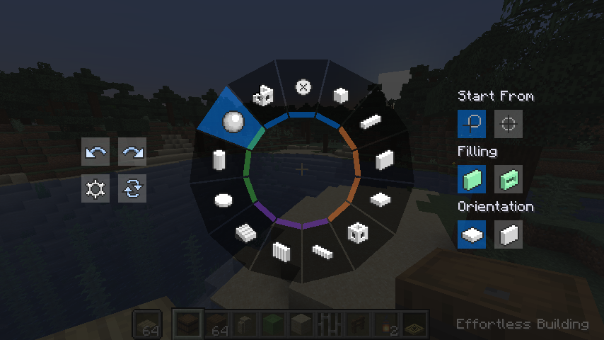
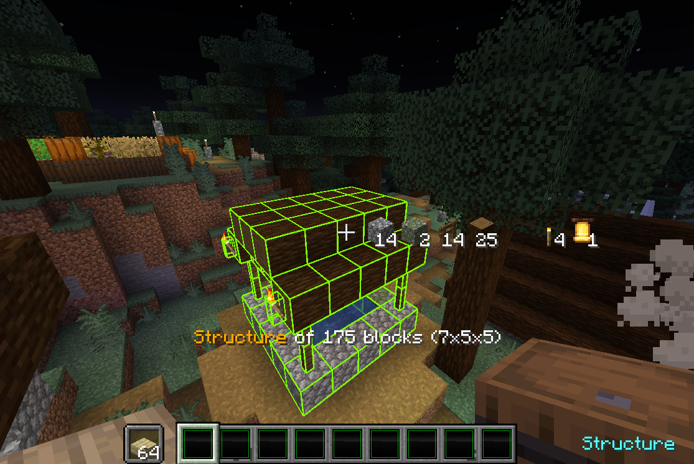
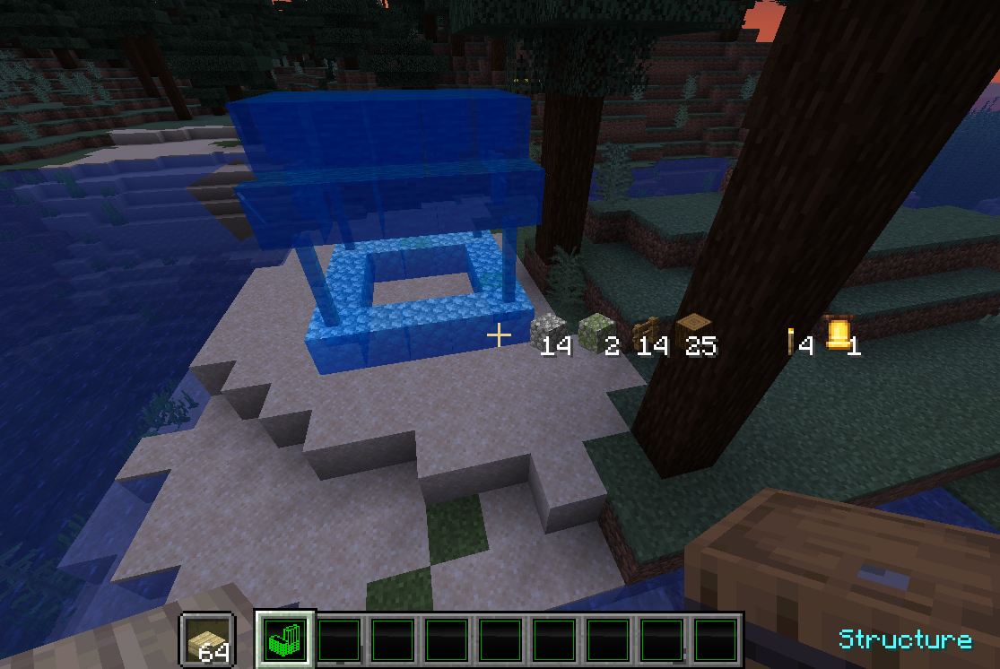

# Effortless Fabric

Effortless Fabric greatly facilitates building larger structures in minecraft, by allowing
you to place and break blocks in geometric shapes like lines, rectangles or cubes.

This is a FORK of the Effortless fabric mod maintained
by [huskcasaca](https://github.com/huskcasaca). Purpose of the
fork is to provide updates for recent minecraft versions, and to add some features that I
wanted.

[Effortless Fabric](https://www.curseforge.com/minecraft/mc-mods/effortless-fabric) in
turn is a fabric port of the famous [Effortless Building](https://www.curseforge.com/minecraft/mc-mods/effortless-building) mod.
This mod implements most features from Effortless Building, but removed randomizer bag and
reach upgrade items to make it a pure vanilla compat one.

## Screenshots
### Building Menu

### Building example: Filled Wall Mode

### Scanning and placing structure

## Installation instructions

If you don't have Fabric yet:

1. Go to https://fabricmc.net and download the Installer.
2. Run it and follow the instructions.
3. Download [Fabric API](https://www.curseforge.com/minecraft/mc-mods/fabric-api) and
   place it in your Minecraft Profile in the ``mods`` subdirectory.

(... If you already have Fabric):

4. Download this mod (Release ``.jar`` file) and place it in the same ``mods`` directory.
5. Start Minecraft launcher and select the Fabric Profile. It should be named 
   ``fabric-loader-<version>``.
6. Run Minecraft: The mod should now be available.
7. (Optional): Download the [modmenu](https://modrinth.com/mod/modmenu)
   and [cloth-config](https://modrinth.com/mod/cloth-config) mods to have access to the
   configuration options. Optional because Effortless works just fine with default 
   settings.

## Building

Hold ALT key to switch build modes in the radial panel. There are buttons for undo/redo,
modifier settings and replace modes on the left. The options for each build mode (like a
filled vs hollow wall) are on the right.

Modes require between one and three clicks to mark out the corner points of the structure.

In Single mode, you can place blocks beneath your feet by looking straight downward. Thus
you can start construction in air or water.

Use R key to toggle replace mode.

Use M key to quickly cycle between X/Z Mirror modes (centered on player's position).

### Remarks about Structure mode

Structure mode (top-left in the menu) is used to copy and paste blocks.

To "scan" blocks to copy, mark out the corner points with right mouse click, as in Cube
mode. Depending on the Replace setting, Scan will start either on or next to the focused
block. This is so that constructions without blocks in the corners can be scanned.

The scanned structure is associated to a Hotbar slot, meaning that you can scan up to 9
different structures. Click left (Attack) to erase a slot. Structures are also forgotten
once you exit the game.

Structures are placed with a single click. Rotation and placement depend on Player's
position and view direction.

### Build Modes

- **Disable**: Place in vanilla way
- **Single**: Place single block
- **Line**: Place lines of blocks in any 3 axis
- **Wall**: Place walls with locked x or z axis
- **Floor**: Place floor with locked y axis
- **Diagonal Line**: Place freeform lines of blocks
- **Diagonal Wall**: Place walls at any angle
- **Slope Floor**: Place slopes at any angle
- **Cube**: Place cubes with 3 clicks
- **Circle**: Place blocks in a circle (ellipse)
- **Cylinder**: Place a cylindrical shape like a tower
- **Sphere**: Place a spheroid made of cubes
- **Structure**: Copy and paste blocks from the world

### Build Modifiers

- **Mirror**: Place blocks and their states in mirror, works with even and uneven builds.
- **Array**: Copies builds and block states in a certain direction a certain number of times.
- **Radial Mirror**: Places blocks in a circle around a certain point. The circle can be divided into slices, and each slide will copy your block placements.

### Replace Modes

- **Disable**: Placing blocks does not replace any existing blocks
- **Normal**: Placing blocks replaces the existing blocks except the first one
- **Quick**: Placing blocks replaces the existing blocks including the first one

## Roadmap
### Future plans as of 1.7.0

- Place / "break" water blocks by holding water bucket
- Stair mode: Place with 45° bevel e.g. for roof corners
- Improve slab handling, particularly allow building of slab stairs

### Known issues

If any of these bothers you particularly, please open a github issue (or Pull request :-))

* Structures cannot be placed mirrored
* Placing torches or other attachable items is not well-tested and most probably buggy.
* Cannot place double-slabs, and making a stair of slabs doesn't work as one would
  probably expect.
* When replacing blocks, will not replace a block of same type but with different
  Blockstate. E.g. when placing stairs, will not "rotate" an existing stair block.
* No "randomizer bag". Might support Shulker chests as stand-in somewhen.
* No support for Forge, Bukkit, etc and won't add this either due to total lack of
  knowhow.

## Changelog
### 1.7.3 (Fork only)

* loosen version requirement for Fabric loader: allow all versions >=0.14.x

### 1.7.2 (Fork only)

* **Add structure-copy mode.** Please consider it "beta" for now. I'm still test-driving it
  to find out how to make handling most convenient for all use cases.
* Fix occasional crash when using modifiers (regression introduced by refactoring)
* Fix calculation of placement size (regression introduced by refactoring)

### 1.7.1 (Fork only)

* Port to Minecraft 1.20.3
* Do not reset sounds when opening menu screen (Issue #1)
* further internal changes

### 1.7.0 (Fork only)
 
* Fix block state changing while "dragging" construction area. Blocks will now be placed
  as they were on first click.
* In particular this fixes that stairs could not be placed upside-down.
* Single mode: can place block in air by looking straight down.
* Add keybind M to cycle X/Z mirror mode.
* Fix mirror being offset by 1/2 block for negative coordinates
* Considerable reorganisation of core building code, to make it easier to modify.
 
### 1.6.5 (Fork only)

* Fix occasional crash when closing radial menu without clicking anything
* Fix toggle-replace-mode keybind not working
 
### Up to 1.6.3
 
See original repository of huskcasaca.

## Credits

* **[huskcasaca](https://github.com/huskcasaca)**, the author
  of [Effortless Fabric](https://www.curseforge.com/minecraft/mc-mods/effortless-fabric)
* **[Requioss](https://www.curseforge.com/members/requioss)**, the author of [Effortless Building](https://www.curseforge.com/minecraft/mc-mods/effortless-building) 

## License

Effortless Fabric is licensed under LGPLv3. For full text see LICENSE file.
